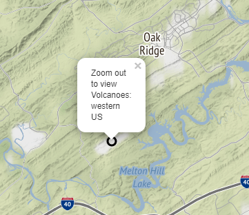
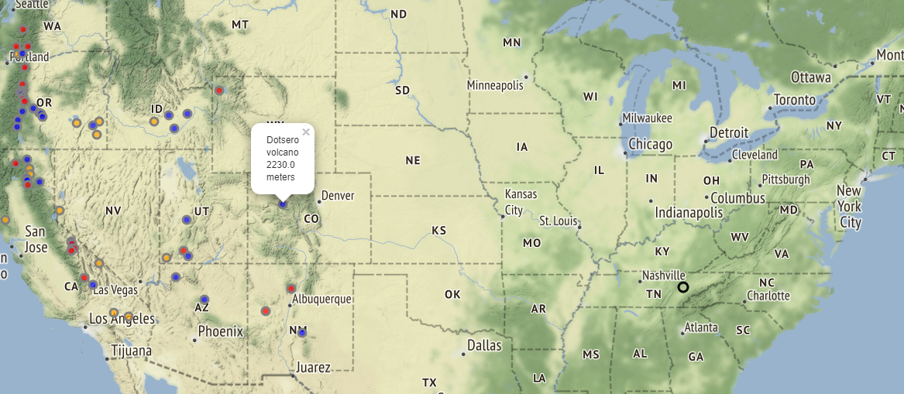

# Interactive Python Map

The dataset was derived from a subset of NOAA Volcano Locations taken from https://www.ngdc.noaa.gov/hazard/volcano.shtml

This project incorporates several Python modules including: 1. Folium 2. Pandas 3. Flask

Please refer to map.py for more detailed comments on the use of the above tools and the methods used in the code.

## Installation

The jenkins-docker-container will build the Jenkins build cluster using terraform and the install_jenkins_docker.sh script.

There are three iterative possibilities being explored to deploy this application.

1. Use the job_container_build.tf to call another terraform module that will directly call the deploy_python_webapp.sh script.

2. Use the job_container_build.tf to call a dockerfile that will deploy the applicaton in a container.

3. Use the job_container_build.tf to call terraform that will run a script to create the Jenkins pipeline and jenkinsfile that will be used to deploy the application.

## Expected behavior

This is a single page with a terrain map and displays popup windows using latidute, longitude, name, and height data to populate know volcanoes in the western United States.

Starting point based on latitude and longitude coordinates.

Popup displaying volcano information

